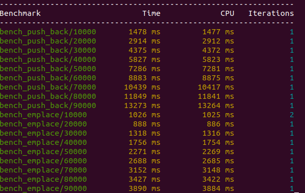
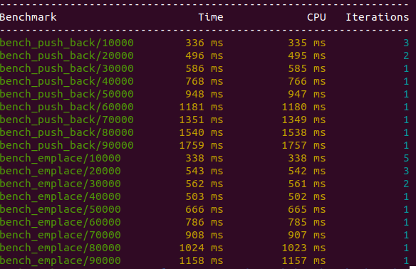
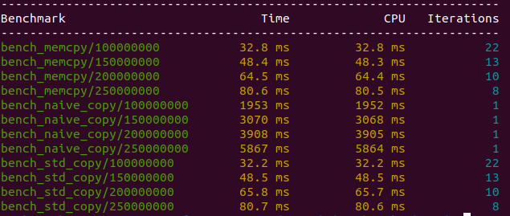
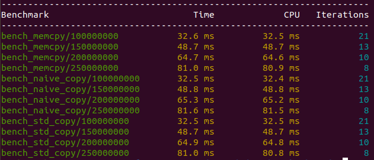
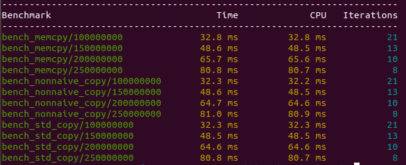
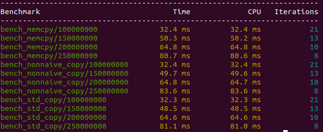

# yLab-benchmarks

compiler: g++ (GCC) 12.2.1 
## push_back and emplace: 
[soucre](https://github.com/tilir/cpp-graduate/blob/master/12-templates/benchemplace.cc)

- debug mode




- -O2




## memcpy, naive copy and std::copy: 
[soucre](https://github.com/tilir/cpp-graduate/blob/master/13-sfinae/benchcopy.cc)
- debug mode




- -O2




## memcpy, non naive copy and std::copy:
[soucre](https://github.com/tilir/cpp-graduate/blob/master/13-sfinae/benchcopy-2.cc)

- debug mode




- -O2





# How to build and run


```
mkdir build
cd build
```
Choose benchmark you want to run using one of these *names:*
- TEST_EMPLACE
- TEST_NAIVE_COPY
- TEST_NON_NAIVE_COPY

-O2:
```
cmake -D<bench name>=ON ..
```
or in
debug mode:
```
cmake -DCMAKE_BUILD_TYPE=Debug -D<bench name>=ON ..
```
```
make
./yLab_benchmark
```